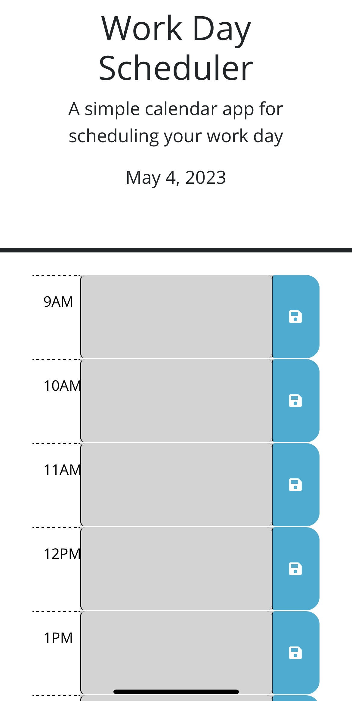

# Work-Day-Schedule

Welcome! This is an application to track daily tasks. When a task is entered into an hour block, it is saved so you can return and review what is to be done at certain times throughout the day. As time progresses, hour blocks will change color indicating the hour block has either passed, is current, or has yet to come.

## About this page
Here is an example screen shot of the webpage:

### Technologies used
- HTML
- CSS
- Javascript

### Credits due
- UNH/edx bootcamp provided HTML and CSS.
- StackOverflow
- Google

#### Link to Portfolio website:
- https://erikamerico.github.io/Work-Day-Schedule/
